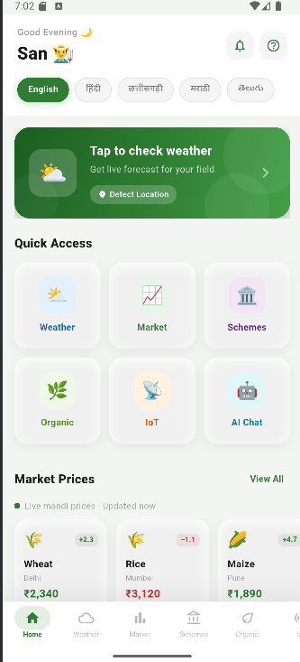
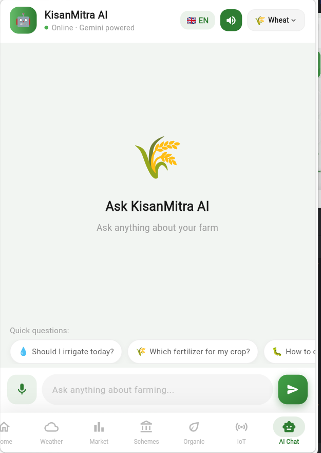
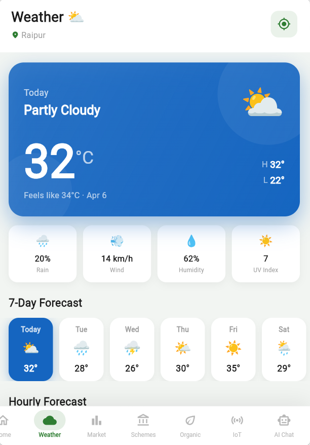
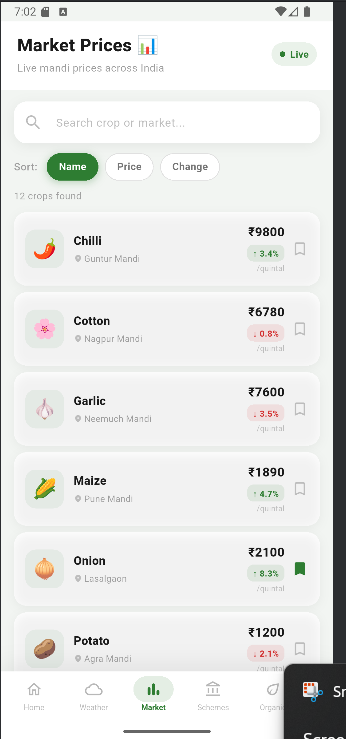
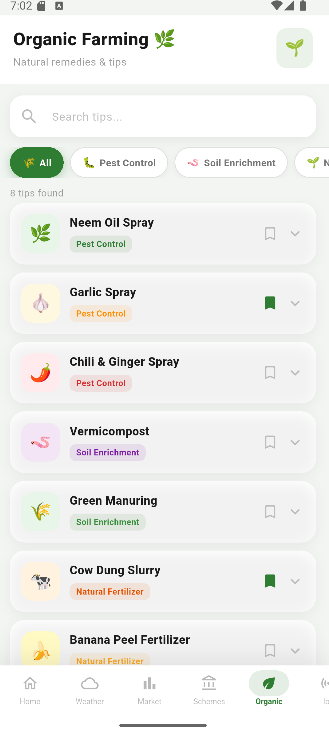

# 🌾 KisanMitra AI

An AI-powered smart farming assistant that combines IoT sensor data with advanced AI to provide real-time agricultural advisory. Designed to help farmers make informed decisions on irrigation, crop health, market prices, and weather conditions.

---

## 🚀 Features

- 🤖 AI chatbot for smart farming assistance (Gemini-powered)
- 🌡️ IoT-based real-time sensor monitoring (Temperature, Humidity, Soil Moisture)
- 🌦️ Weather forecasting with advisory insights
- 📈 Live mandi & market price tracking
- 🥬 Organic crop pricing insights
- 🎤 Voice input & output support
- 🌍 Multilingual support (Hindi + English)
- 🔁 AI fallback responses when sensor data is unavailable

---

## 🏗️ Tech Stack

- **Frontend:** Flutter  
- **Backend:** Firebase  
- **AI:** Gemini API  
- **IoT:** ESP32, DHT11, Soil Moisture Sensor  

---

## 📱 App Screenshots

### 🏠 Home Screen

- Central dashboard with navigation to all features  
- Quick access to chatbot, weather, and market  

---

### 🤖 Chatbot Screen

- AI-powered assistant for farming queries  
- Supports real-time advice using sensor data  

---

### 🌦️ Weather Screen

- Shows current weather and forecast  
- Helps in planning irrigation & farming activities  

---

### 📊 Market Prices

- Displays crop prices in different markets  
- Helps farmers decide best selling time  

---

### 🥬 Organic Prices

- Shows pricing for organic produce  
- Encourages sustainable farming decisions  

---

## 🔄 System Architecture
IoT Sensors → ESP32 → Firebase → Flutter App → Gemini AI → Smart Advisory
---

## 📊 Sample Interaction

**User:** Should I irrigate today?  

**AI Response:**  
- Soil moisture is low (25%)  
- Irrigation required  
- Best time: early morning  

⚡ **Action:** Start irrigation now  
